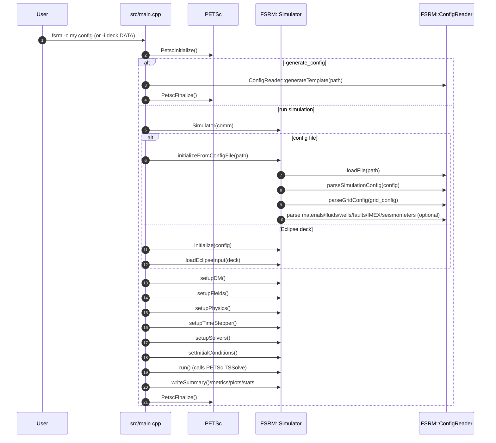
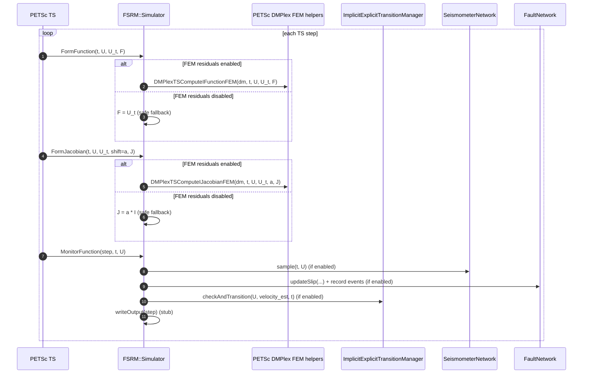
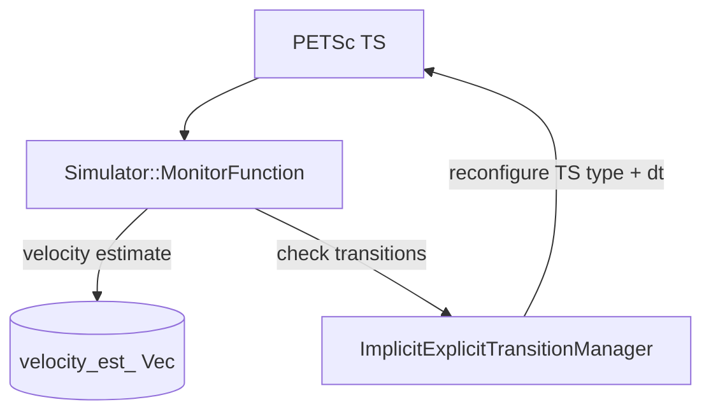

# FSRM Code Interaction Diagrams

This document explains **how the codebase fits together at runtime** (startup → time stepping → outputs), and how the major modules interact.

It complements (does not replace) the topic docs:
- [PHYSICS_AND_GPU_ARCHITECTURE.md](PHYSICS_AND_GPU_ARCHITECTURE.md)
- [IMEX_TRANSITION.md](IMEX_TRANSITION.md)
- [CONFIGURATION.md](CONFIGURATION.md)
- [API_REFERENCE.md](API_REFERENCE.md)

---

## 1) Top-level component map

### Runtime “big picture”

```mermaid
graph TD
  CLI[CLI: src/main.cpp] -->|PETSc init + parse -c/-i| SIM[FSRM::Simulator]

  SIM --> CFG[FSRM::ConfigReader]
  SIM --> IO1[EclipseIO]
  SIM --> IO2[Gmsh mesh via PETSc DMPlex]
  SIM --> CRS[CoordinateSystemManager]

  SIM --> DM[PETSc DM (DMPlex)]
  SIM --> FIELDS[DM fields (PetscFE) + Vec solution]
  SIM --> DS[PetscDS discretization]
  SIM --> TS[PETSc TS]
  TS --> SNES[PETSc SNES]
  SNES --> KSP[PETSc KSP/PC]

  SIM --> KERNELS[PhysicsKernel instances]
  KERNELS -->|setup(dm, fe)| DM

  TS -->|calls IFunction/IJacobian| CB[Simulator::FormFunction / FormJacobian]
  TS -->|calls monitor| MON[Simulator::MonitorFunction]

  MON --> OUT[Output (summary/statistics; field output stub)]
  MON --> SEIS[SeismometerNetwork (optional)]
  MON --> FAULTS[FaultNetwork + seismicity (optional)]
  MON --> IMEX[ImplicitExplicitTransitionManager (optional)]
```

### What owns what (lifetime/ownership)

- **`src/main.cpp`** constructs **`FSRM::Simulator`** and drives the lifecycle.
- **`FSRM::Simulator`** owns the PETSc objects it creates: `DM`, `TS`, solution vectors, Jacobian, etc.
- **Physics kernels** (`include/PhysicsKernel.hpp`, `src/PhysicsKernel.cpp`) are stored in `Simulator::kernels` and configured during `setupPhysics()`.
- **Optional subsystems** (only created when configured):
  - `SeismometerNetwork` (`include/SeismometerNetwork.hpp`) is created in `setupFields()`.
  - `ImplicitExplicitTransitionManager` (`include/ImplicitExplicitTransition.hpp`) is created in `setupTimeStepper()` if `[IMEX]` is enabled.
  - `FaultNetwork` (`include/FaultModel.hpp`) is parsed during config load when faults are enabled.

---

## 2) Startup sequence (what happens when you run `fsrm`)



---

## 3) Time stepping: who calls whom each step

FSRM uses PETSc’s time stepper (`TS`) in **implicit form**:
- PETSc calls **`Simulator::FormFunction`** (IFunction) and **`Simulator::FormJacobian`** (IJacobian).
- PETSc also calls **`Simulator::MonitorFunction`** each step for logging and “side effects” (output, IMEX transitions, seismometers, fault updates).



### Important implementation note (current code behavior)

In `Simulator::setupPhysics()` the code explicitly documents that **only some configurations are wired into PETSc’s FEM assembly path** today.

- **FEM residuals are enabled** when:
  - `fluid_model == SINGLE_COMPONENT` (pressure diffusion)
  - `fluid_model == BLACK_OIL` (pressure residual + saturation “placeholders”)
- **FEM residuals are disabled** otherwise, and the solver uses a **safe placeholder**:
  - `FormFunction`: `F = U_t` → effectively enforces “no time evolution” for unsupported configurations
  - `FormJacobian`: `J = shift * I`

This is intentional to keep runs from crashing when residual/Jacobian callbacks for all enabled fields are not registered yet.

---

## 4) Mesh + region labeling interactions (Gmsh)

When `GRID.mesh_type = GMSH` or `GRID.mesh_file` ends with `.msh`, `Simulator::setupGmshGrid()` loads the mesh via PETSc:
- `DMPlexCreateGmshFromFile(...)` creates a `DM` with labels.
- If you configured name-based mappings (materials/faults/boundaries), FSRM:
  - parses `$PhysicalNames` from the `.msh` header
  - maps **physical group names** → **integer IDs**
  - writes those IDs into DM labels: `Material` (cells), `Fault` / `Boundary` (faces)

```mermaid
graph LR
  MSH[.msh file] -->|PETSc| DM[DM (DMPlex)]
  MSH -->|parse $PhysicalNames| PHYS[physical name -> (dim,tag)]

  CFG[GRID.gmsh_material_mapping / gmsh_fault_mapping / gmsh_boundaries]
    --> MAPS[name-based mapping tables]

  PHYS --> MAPS
  MAPS -->|label cells| MATLBL[DMLabel "Material"]
  MAPS -->|label faces| FLTLBL[DMLabel "Fault"]
  MAPS -->|label faces| BNDLBL[DMLabel "Boundary"]
  MATLBL --> DM
  FLTLBL --> DM
  BNDLBL --> DM
```

---

## 5) IMEX (implicit↔explicit) interactions

IMEX is implemented in `include/ImplicitExplicitTransition.hpp` / `src/ImplicitExplicitTransition.cpp`.

There are **two monitors** involved in the codebase:
- `ImplicitExplicitTransitionManager` registers its own PETSc monitor (`IMEXMonitor`) when initialized.
- `Simulator::setupTimeStepper()` then intentionally restores `Simulator::MonitorFunction` as the active TS monitor, and **manually calls** `imex_manager->checkAndTransition(...)` from within `Simulator::MonitorFunction`.

Why that matters:
- `Simulator::MonitorFunction` also handles outputs, seismometers, and fault updates.
- The IMEX manager needs a velocity estimate; the simulator computes a simple finite-difference velocity from `U` and the previous solution.



---

## 6) GPU interactions (as designed)

The intended GPU story is:
- `GPUManager` provides device discovery + allocation + copy + synchronize.
- GPU-capable kernels live in `include/PhysicsKernel_GPU.hpp` and use the manager to allocate and run kernels.

However, when documenting “how it is supposed to work”, it’s important to separate:
- **Design intent** (kernel factory chooses CPU vs GPU; kernels dispatch based on size/availability)
- **Current integration state** (the main `Simulator::setupPhysics()` currently instantiates CPU kernels directly; GPU selection isn’t wired into that path yet).

---

## 7) Suggested mental model for contributors

If you’re adding a new physics module, think in layers:

1. **Config layer** (`ConfigReader`)
   - Parse flags/parameters into `SimulationConfig` / `GridConfig` / domain-specific config structs.
2. **Wiring layer** (`Simulator`)
   - Decide which fields exist (`setupFields()`)
   - Decide which residual/Jacobian callbacks are active (`setupPhysics()` + `PetscDSSetResidual/Jacobian`)
   - Decide how time stepping is configured (`setupTimeStepper()`)
3. **Physics layer** (`PhysicsKernel`)
   - Provide per-quadrature-point residual/Jacobian logic OR provide PETScFE callback functions.
4. **Side-effect layer** (`MonitorFunction`)
   - Output sampling, event detection, IMEX transitions, instrumentation.

---

## 8) Pointers to the concrete entry points

- **CLI entry**: `src/main.cpp`
- **Main orchestrator**: `src/Simulator.cpp`, `include/Simulator.hpp`
- **Config parsing**: `src/ConfigReader.cpp`, `include/ConfigReader.hpp`
- **Time stepping callbacks**: `Simulator::FormFunction`, `Simulator::FormJacobian`, `Simulator::MonitorFunction`
- **IMEX**: `include/ImplicitExplicitTransition.hpp`, `src/ImplicitExplicitTransition.cpp`
- **Seismometers**: `include/SeismometerNetwork.hpp`
- **Kernel interface**: `include/PhysicsKernel.hpp`, `src/PhysicsKernel.cpp`
